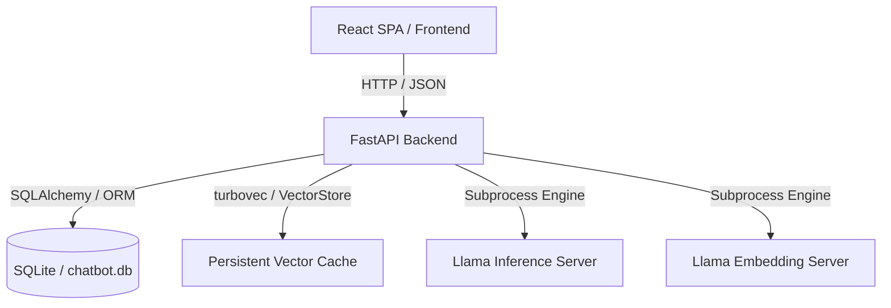

🇧🇷 Português (você está aqui) · [🇺🇸 Read this in English](README.md)

# SophIA Persona Engine

**SophIA Persona Engine** é o runtime de personalidade, memória e estado da
personagem para a companion de desktop SophIA. O projeto é um fork do
Open-ChatBot e preserva seu motor **local-first** para personagens com estado e
memória persistente, baseado no **Living Entity Framework v5** e executado de
forma 100% local e privada.

### Estado da integração com a SophIA

O MVP da SophIA possui uma única identidade contínua. Ele não expõe novo chat,
sessões, histórias ou cenas; esses recursos pertencem à aplicação Open-ChatBot
herdada. A PE4 fornece memória seletiva controlável pelo usuário sem reter
áudio bruto ou transcrições completas. Consulte a
[ADR-007](docs/pt-BR/architecture/decisions/adr-007.md).

A persona controla como a SophIA expressa o resultado de uma ferramenta, nunca
suas permissões, credenciais, argumentos validados ou sucesso factual. A futura
fronteira tipada foi implementada na PE5: o contrato de contexto de ação recebe
somente fatos já autorizados e executados. A decisão está na
[ADR-008](docs/pt-BR/architecture/decisions/adr-008.md).

A Milestone PE2 expõe o contrato de persona da PE1 por um serviço loopback
dedicado e versionado. Ele inicializa apenas a persistência—sem LLM, RAG,
frontend ou runtime de voz:

```bash
python -m src.backend.persona_main
curl http://127.0.0.1:8765/v1/health
curl http://127.0.0.1:8765/v1/personas/1/snapshot
```

A API 1.2 também fornece `turn-context`, operações seletivas de memória e
`action-context`. Ela continua sem executar ferramentas ou possuir credenciais.

A API de domínio continua independente de transporte:

```python
from src.backend.core.persona import PersonaEngine

snapshot = PersonaEngine().build_snapshot(character, state, user)
print(snapshot.system_prompt)
```

A aplicação FastAPI + React existente continua como host legado enquanto o
motor é extraído incrementalmente. Sua documentação de chats, cenas e múltiplos
personagens não é o contrato do MVP SophIA. Consulte a
[ADR-005](docs/pt-BR/architecture/decisions/adr-005.md) para responsabilidade
de domínio e a [ADR-006](docs/pt-BR/architecture/decisions/adr-006.md) para a
fronteira da API local. O contrato legível por máquina está em
[persona-v1.openapi.yaml](docs/en/api/persona-v1.openapi.yaml).

Gate focado da PE2:

```bash
python -m pytest src/backend/__tests__/test_persona_api.py \
  src/backend/__tests__/test_persona_engine.py -q
```

### 🎥 Demo — memória persistente entre turnos


---

## 🛠️ Arquitetura do Sistema

A solução é dividida em serviços desacoplados de alta performance:



1.  **Inference & Embedding Subsystem:** Camada de baixo nível gerenciada via binários locais do `llama-server.exe` (llama.cpp) com suporte a offloading de GPU completo (`gpu_layers: 99`), flash attention e quantizações imat GGUF. Configurado centralmente através do [models_config.example.json](models_config.example.json). A quantização de KV-cache `turbo3` vem do fork [llama-cpp-turboquant-SYCL](https://github.com/FellypeMelo/llama-cpp-turboquant-SYCL) (2–4 bit, rotação Walsh–Hadamard, otimizado para Intel Arc / SYCL).
2.  **FastAPI Backend:** API assíncrona responsável pela orquestração do pipeline de memória, evolução comportamental e exposição de endpoints RESTful.
3.  **React Frontend:** Interface administrativa e de conversação reativa construída com React, TypeScript, Vite e TailwindCSS, consumindo a API do backend de forma assíncrona.

---

## 🧠 Living Entity Framework v5

O motor cognitivo do chatbot baseia-se em um template dinâmico de 6 camadas (definido no componente [Brain](src/backend/core/orchestration/bridge.py)):

1.  **Master Prompt:** Define as regras rígidas de consistência e persona do agente.
2.  **Identity:** Características permanentes da persona do agente.
3.  **Modifiers & Social Dynamics:** Dinâmicas sociais contextuais e regras comportamentais derivadas de interações passadas.
4.  **State & User Info:** Variáveis de estado da simulação comportamental (energia, disponibilidade, rapport social) e metadados sobre o usuário conectado.
5.  **Context (RAG + Lorebook):** Memórias episódicas injetadas via similaridade de cossenos no Vector Store e informações de lore ativadas por palavras-chave.
6.  **History & Short-term Memory:** Janela deslizante do histórico recente da sessão atual.

---

## 🏛️ Práticas de Engenharia de Software Aplicadas

A base de código segue rigorosamente padrões industriais de engenharia de software para garantir escalabilidade horizontal, desacoplamento e testabilidade:

### 1. Clean Architecture (Separação Arquitetural)
O projeto define fronteiras claras entre suas camadas lógicas:
*   **Domain & Use Cases (Core):** Em [src/backend/core](src/backend/core), isola toda a lógica do modelo comportamental, evolução psicológica e processamento RAG. Esta camada é pura e agnóstica de transporte ou persistência.
*   **Infrastructure (DB):** Em [src/backend/db](src/backend/db), encapsula a persistência relacional com SQLite/SQLAlchemy.
*   **Interface Adapters (API):** Em [src/backend/api](src/backend/api), gerencia as rotas FastAPI, regras de CORS, middlewares e parsing de esquemas com Pydantic.
*   **Presentation (Frontend):** Uma aplicação Web SPA contida em [src/frontend](src/frontend), comunicando-se exclusivamente por JSON com o backend.

### 2. Princípios SOLID
*   **Single Responsibility (SRP):** Cada classe e módulo foca em um único domínio funcional. A classe [Brain](src/backend/core/orchestration/bridge.py) em [bridge.py](src/backend/core/orchestration/bridge.py) encapsula exclusivamente a construção do prompt e a interação de inferência, enquanto a persistência das tags e relacionamentos é delegada ao ORM.
*   **Dependency Inversion (DIP):** Dependência de abstrações. O banco de dados (`Session`) e os clientes de LLM são injetados nas classes core via construtores, eliminando o acoplamento forte e simplificando o processo de injeção em testes unitários.

### 3. Design Patterns
*   **Facade / Orchestration:** A classe [Brain](src/backend/core/orchestration/bridge.py) abstrai a complexidade do pipeline de geração de respostas, ocultando acessos concorrentes ao Vector Store, banco de dados relacional e mecanismos de parser.
*   **Data Mapper / Repository:** O mapeamento declarativo do SQLAlchemy em [models.py](src/backend/db/models.py) atua isolando a lógica de negócio das transações relacionais.
*   **Strategy Pattern:** A inicialização e parametrização dos runners de inferência e embedding variam com base no mapeamento do [models_config.example.json](models_config.example.json), implementando diferentes parâmetros de inicialização de subprocessos sem alterar o fluxo do servidor principal.

### 4. Testes Automatizados e Ciclo de Vida Isolado
*   **Database Mocking & Isolation:** A suíte de testes unitários e de integração utiliza instâncias de bancos de dados isolados temporários para garantir que nenhum dado operacional (`chatbot.db`) seja corrompido durante a execução de testes.
*   **Coverage Rules:** Cobertura de testes mantida a $\ge 80\%$ (conforme estipulado no [GEMINI.md](GEMINI.md)) tanto no backend (`pytest`) quanto no frontend.

---

## ⚡ Inicialização e Orquestração

O projeto inclui scripts de automação multi-processo que executam o build estático do frontend, orquestram os dois subprocessos de IA local e inicializam o servidor Uvicorn do backend.

### Pré-requisitos
*   **Runtime Python:** >= 3.10
*   **Node.js & Package Manager:** `pnpm` instalado globalmente.
*   **Drivers:** Suporte a aceleração de hardware (ex: Intel oneAPI ou CUDA instalados no local padrão).

### Execução Automatizada

**Windows (PowerShell ou Command Prompt):**
```cmd
run.bat
```

**Linux / macOS:**
```bash
chmod +x run.sh
./run.sh
```

*Nota: O fluxo automatizado executa `pnpm build` no diretório [src/frontend](src/frontend) e expõe a build estática via FastAPI sob `/static`.*

### Migrações de schema

O `init_db()` constrói/atualiza o schema no startup e o marca (`stamp`) na revisão
Alembic atual. Mudanças de schema são versionadas via Alembic
(`src/backend/db/migrations/`); ao atualizar o código, rode você mesmo:

```bash
venv/Scripts/python.exe -m alembic upgrade head
```

---

## 📚 Documentação

A documentação interna vive em duas árvores espelhadas: [docs/en/](docs/en/) (inglês) e [docs/pt-BR/](docs/pt-BR/) (português). Comece por [docs/README.md](docs/README.md) para o índice de idiomas, ou vá direto aos documentos:

*   **[docs/pt-BR/architecture.md](docs/pt-BR/architecture.md)** — fluxos big-picture (turn flow, ciclo de memória, reflexão).
*   **[docs/pt-BR/data-model-er.md](docs/pt-BR/data-model-er.md)** — modelo Entidade-Relacionamento + decisões de schema.
*   **[docs/pt-BR/testing.md](docs/pt-BR/testing.md)** — como rodar testes, isolamento, e adicionar features com segurança.
*   **[docs/pt-BR/mobile-lan-smoke-test.md](docs/pt-BR/mobile-lan-smoke-test.md)** — checklist manual de smoke test em dispositivo móvel real via LAN (complementa a emulação mobile do Playwright).
*   **[docs/pt-BR/card-authoring-epic.md](docs/pt-BR/card-authoring-epic.md)** — como escrever uma card E.P.I.C. (persona, cena, tiques, exemplos) que faz um modelo pequeno brilhar.
*   **[docs/pt-BR/setup/quickstart.md](docs/pt-BR/setup/quickstart.md)** — referência consolidada de setup/execução.
*   **[docs/pt-BR/README.md](docs/pt-BR/README.md)** — índice completo da documentação (arquitetura, ADRs, contrato de API, compliance, requisitos).
*   **[CLAUDE.md](CLAUDE.md)** — guia de comandos e arquitetura para contribuidores/agentes.
