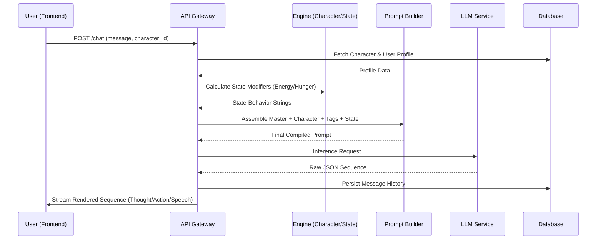
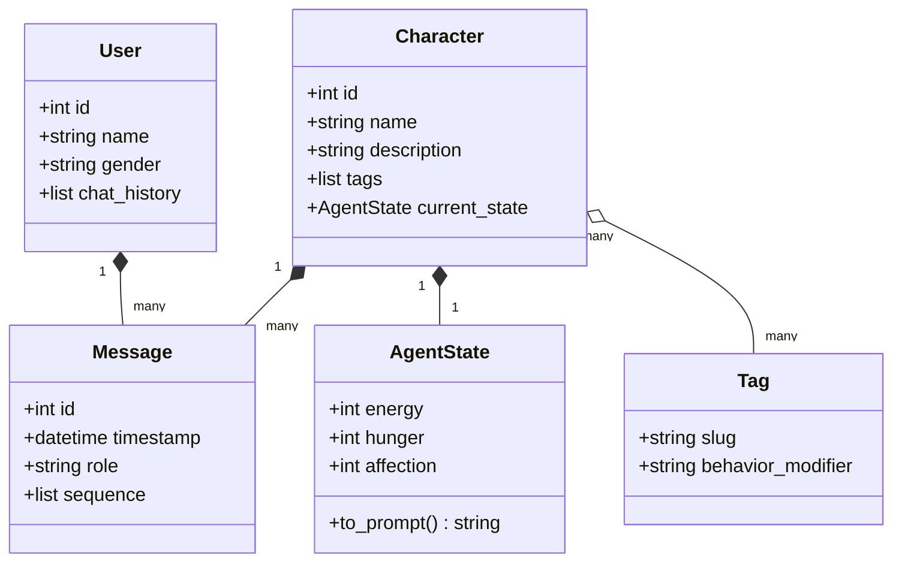
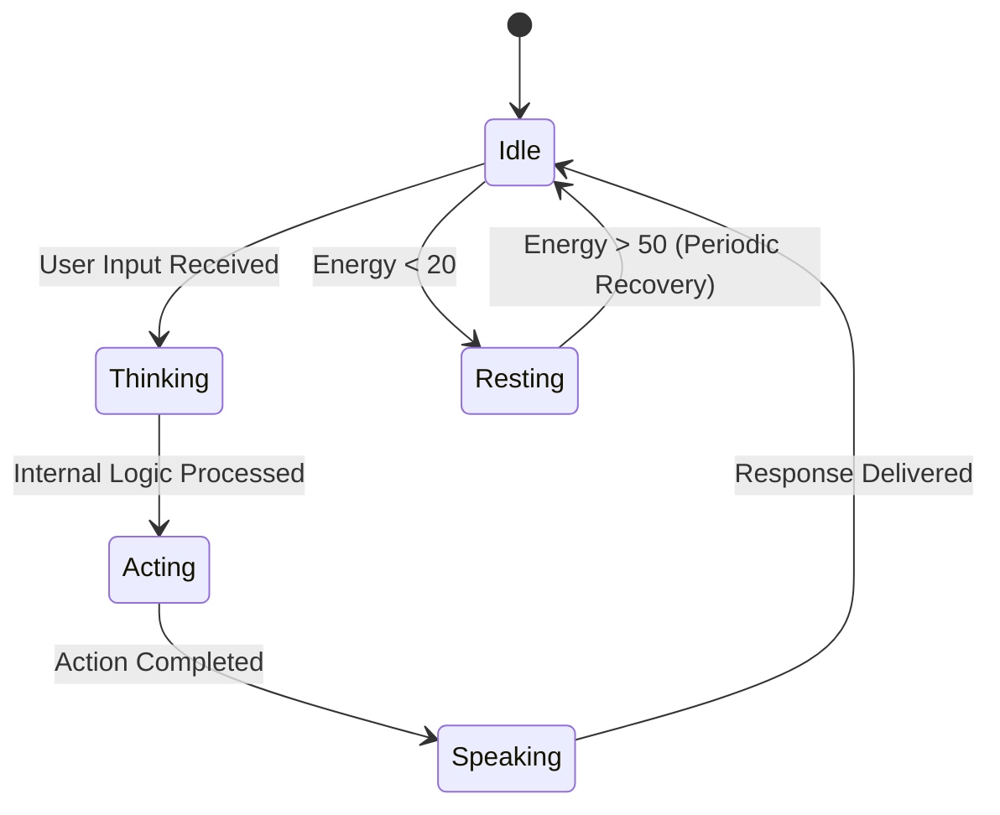

# UML Diagrams — Open-ChatBot

> **Legacy diagrams:** chats, multiple characters, narrative scenes and
> "Action Completed" below model Open-ChatBot only. They are not the SophIA MVP
> architecture or proof of tool execution; see ADR-007/008.

## 1. Sequence Diagram: AI Response Pipeline
Describes the flow from user input to rendered narrative sequence.

## 2. Class Diagram: Core Domain Model
Defines the structural relationships between core entities.

## 3. State Machine: Character Engagement
Tracks the emotional and physical state of the character.

